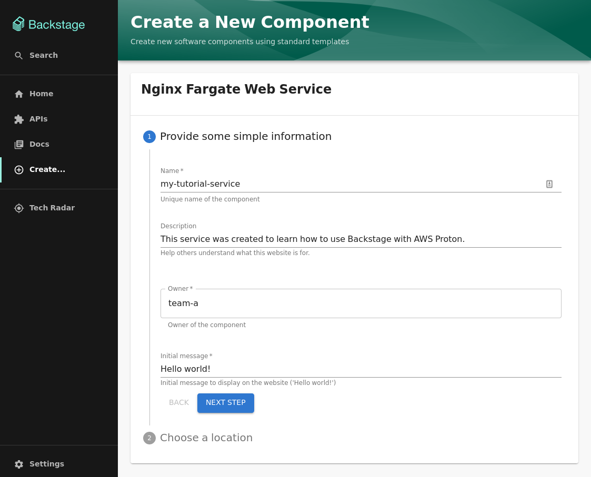
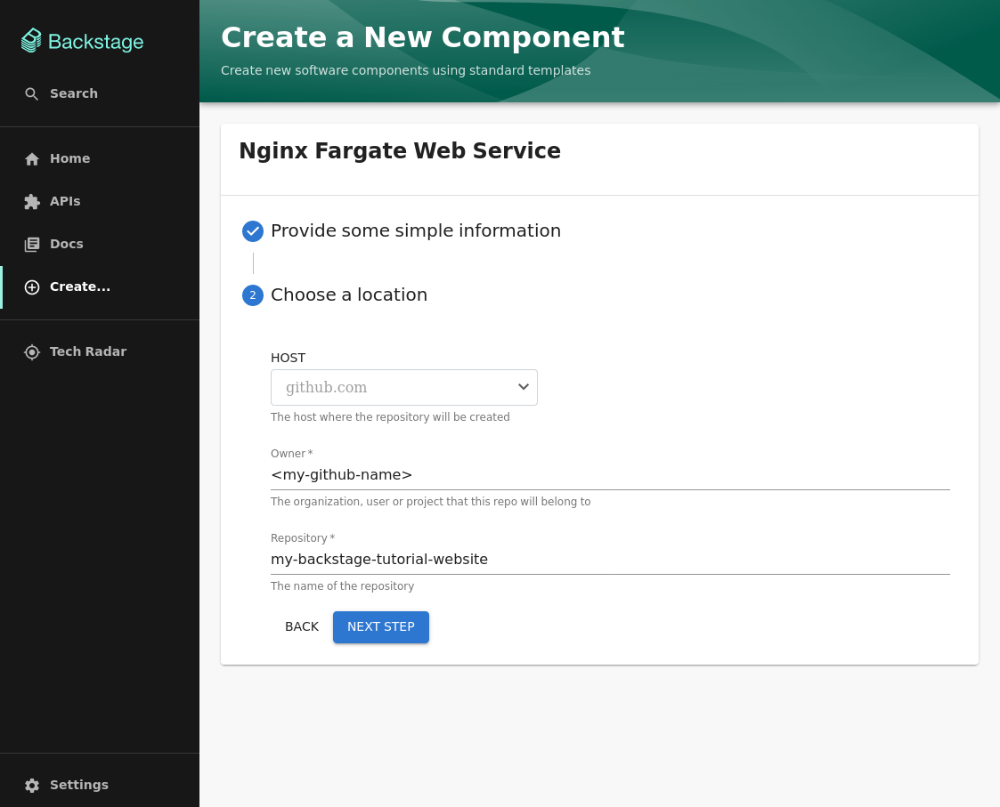
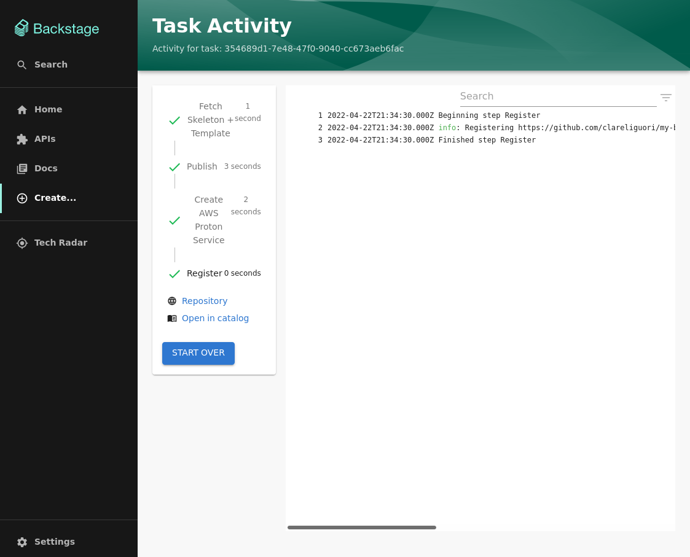
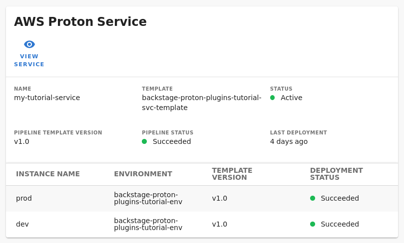

# Tutorial: using the AWS Proton plugins for Backstage

This tutorial walks you through an example of using the AWS Proton plugins for Backstage.

Tutorial steps:

<!-- toc -->
1. [Set up your Backstage app](#set-up-your-backstage-app)
1. [Fork this repository](#fork-this-repository)
1. [Create prerequisite AWS resources](#create-prerequisite-aws-resources)
1. [Customize the sample software template](#customize-the-sample-software-template)
1. [Register the software template in your Backstage app](#register-the-software-template-in-your-backstage-app)
1. [Create a Backstage component using the software template](#create-a-backstage-component-using-the-software-template)
1. [Tear down AWS resources](#tear-down-aws-resources)
<!-- tocstop -->

## Set up your Backstage app

This tutorial assumes that you have a working Backstage application.  To use this tutorial with a local Backstage app, follow the main [Backstage instructions](https://backstage.io/docs/getting-started/create-an-app) to create and run a Backstage app locally.

This tutorial also assumes that your Backstage app is connected to GitHub.  Ensure that you have a GitHub [personal access token](https://docs.github.com/en/authentication/keeping-your-account-and-data-secure/creating-a-personal-access-token) for Backstage, and set a `GITHUB_TOKEN` environment variable with that token in the environment where your Backstage app is running.  The token needs the `repo` scope.  For more information on connecting your Backstage app to GitHub, see [GitHub Locations](https://backstage.io/docs/integrations/github/locations) in the Backstage documentation.

Follow the [AWS Proton plugins for Backstage installation guide](install.md) to install the Proton plugins into your Backstage application.

## Fork this repository

This repository contains a sample Backstage software template. You use it to configure your AWS account information and register the plugins into your Backstage app.  You can create a public fork of this repository. Alternatively, duplicate this repository into a private repository (preferred).  For more information, see [Duplicating a repository](https://docs.github.com/en/repositories/creating-and-managing-repositories/duplicating-a-repository) in the GitHub documentation.

## Create prerequisite AWS resources

Create the following AWS resources in your AWS account for this tutorial:
* An AWS CodeStar Connections repository connection
* An AWS Proton registered repository
* An AWS Proton environment template
* An AWS Proton service template
* An AWS Proton environment

To create these resources, follow the **AWS Proton setup** section of the **Getting Started** guide in the AWS Proton console:

https://us-east-1.console.aws.amazon.com/proton/home?region=us-east-1#/getting-started

While you're following the **Getting Started** guide:
* Fork the [AWS Proton Sample CloudFormation Templates](https://github.com/aws-samples/aws-proton-cloudformation-sample-templates/) repository into your GitHub account. Then, register the forked repository with AWS Proton. For more information, see [Create and register a link to your repository](https://docs.aws.amazon.com/proton/latest/adminguide/ag-create-repo.html) in the *AWS Proton Administrator Guide*.
* To create the environment template, choose **Sync a template bundle with Git** and use the `environment-templates/fargate-env` example in the forked repository.
* To create the service template, choose **Sync a template bundle with Git** and use the `service-templates/load-balanced-fargate-svc` example in the forked repository.
* Proton creates each new template with a template version 1.0 that you need to publish. Select the template version, choose **Publish**, and wait for the template version to go into the **Published** status.

At the end of the **Getting started** guide, you should have at least one of each of the resources listed above. You can verify using the following commands:

```
$ aws codestar-connections list-connections
{
    "Connections": [
        {
            "ConnectionName": "my-github-account",
            "ConnectionArn": "arn:aws:codestar-connections:us-east-1:111111111111:connection/c176b204-5bb1-48f1-b977-5aff4fa2df9d",
            "ProviderType": "GitHub",
            "OwnerAccountId": "111111111111",
            "ConnectionStatus": "AVAILABLE"
        }
    ]
}

$ aws proton list-repositories
{
    "repositories": [
        {
            "arn": "arn:aws:proton:us-east-1:111111111111:repository/github:<your-github-name>/aws-proton-cloudformation-sample-templates",
            "name": "<your-github-name>/aws-proton-cloudformation-sample-templates",
            "provider": "GITHUB"
        }
    ]
}

$ aws proton list-environment-templates
{
    "templates": [
        {
            "arn": "arn:aws:proton:us-east-1:111111111111:environment-template/backstage-proton-plugins-tutorial-env-template",
            "createdAt": "2022-04-21T11:29:01.800000-07:00",
            "description": "Environment template for the Proton Backstage plugins tutorial",
            "displayName": "Backstage tutorial template",
            "lastModifiedAt": "2022-04-21T11:29:01.800000-07:00",
            "name": "backstage-proton-plugins-tutorial-env-template",
            "recommendedVersion": "1.0"
        }
    ]
}

$ aws proton list-service-templates
{
    "templates": [
        {
            "arn": "arn:aws:proton:us-east-1:111111111111:service-template/backstage-proton-plugins-tutorial-svc-template",
            "createdAt": "2022-04-21T11:48:07.137000-07:00",
            "description": "Service template for the Proton Backstage plugins tutorial",
            "displayName": "Backstage tutorial template",
            "lastModifiedAt": "2022-04-21T11:48:07.137000-07:00",
            "name": "backstage-proton-plugins-tutorial-svc-template",
            "recommendedVersion": "1.0"
        }
    ]
}

$ aws proton list-environments
{
    "environments": [
        {
            "arn": "arn:aws:proton:us-east-1:111111111111:environment/backstage-proton-plugins-tutorial-env",
            "createdAt": "2022-04-21T11:53:07.528000-07:00",
            "deploymentStatus": "SUCCEEDED",
            "description": "Environment for the Proton Backstage plugins tutorial",
            "lastDeploymentAttemptedAt": "2022-04-21T11:53:07.528000-07:00",
            "lastDeploymentSucceededAt": "2022-04-21T11:53:07.528000-07:00",
            "name": "backstage-proton-plugins-tutorial-env",
            "protonServiceRoleArn": "arn:aws:iam::111111111111:role/ProtonServiceRole",
            "templateMajorVersion": "1",
            "templateMinorVersion": "0",
            "templateName": "backstage-proton-plugins-tutorial-env-template"
        }
    ]
}
```

## Customize the sample software template

You need to update the sample software template with the AWS resources you created in your account in the previous step.  Clone your fork of this repository, and make the following changes to the file `docs/tutorial-assets/fargate-nginx-template/template.yaml`.

1. Find the `template` step.  Update the `aws_proton_dev_environment_name`, `aws_proton_prod_environment_name`, `aws_account_id`, and `aws_region` fields to match the resources in your AWS account.
   
   Note: The template is set up to create a service with instances in two environments, dev and prod. For the purpose of this tutorial, we use a single example environment, `backstage-proton-plugins-tutorial-env`, for both the dev and prod environments.
2. Find the `create-proton-service` step.  Update the `region`, `templateName`, `templateMajorVersion`, and `repositoryConnectionArn` fields to match the resources in your AWS account.

Commit and push these changes to your fork of this repository.

## Register the software template in your Backstage app

Edit your Backstage app configuration file to register your customized software template in your Backstage app.  For example, the file may be named `app-config.yaml`.

In the `catalog` section of the config file, add the following location to the `locations` list. Replace `<your-github-name>` with your GitHub account name.

```yaml
    # AWS Proton Plugins for Backstage tutorial template
    - type: url
      target: https://github.com/<your-github-name>/aws-proton-plugins-for-backstage/blob/main/docs/tutorial-assets/fargate-nginx-template/template.yaml
      rules:
        - allow: [Template]
```

Save your config file changes and restart your Backstage app.

## Create a Backstage component using the software template

In your Backstage app, create a Backstage component that uses your customized software template.  Go to `https://<your backstage app>/create`, and choose the "Nginx Fargate Web Service" template.  Fill in a component name like `my-tutorial-service`.

> Note:
>
> *Backstage components* are different than [Proton components](https://docs.aws.amazon.com/proton/latest/adminguide/ag-components.html), which are service extensions that allow developers to augment Proton services with additional provisioned resources.



In the next step, fill in a name like `my-backstage-tutorial-website` for the private repository that Backstage will create for this new component.



When the software template runs, you should see that Backstage successfully fetches the template, publishes initial code to a new GitHub repository, creates the AWS Proton service, and registers the component in the Backstage software catalog.



Go to the new component's page: `http://<your backstage app>/catalog/default/component/my-tutorial-service`.  You should see an **AWS Proton Service** card in the component's **Overview** tab. The service has two service instances, one in each of the two environments, **dev** and **prod**.



If you later need to re-register this component in your Backstage app, add the following location to the `locations` list in the `catalog` section of your Backstage app config file. Replace `<your-github-name>` with your GitHub account name.

```
    - type: url
      target: https://github.com/<your-github-name>/my-backstage-tutorial-website/blob/main/catalog-info.yaml
      rules:
        - allow: [Component]
```

## Tear down AWS resources

You don't get charged for using AWS Proton or for creating templates. However, when you provision other AWS resources, like Fargate tasks, by deploying environments and services, you are charged for these resources.  When you are finished with this tutorial, you may want to delete your Proton environments and services by running the following commands.

```
$ aws proton delete-service --name my-tutorial-service

$ aws proton wait service-deleted --name my-tutorial-service

$ aws proton delete-environment --name backstage-proton-plugins-tutorial-env
```
