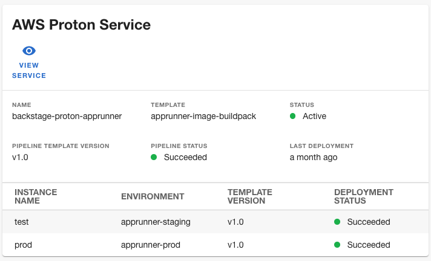

# AWS Proton backend plugin for Backstage

This backend plugin for Backstage adds functionality to interact with [AWS Proton](https://aws.amazon.com/proton/). The plugin provides:
- Backend APIs to retrieve the status of an AWS Proton service.
- A scaffolder action to create an AWS Proton service.

## Installation

See the [AWS Proton plugins for Backstage installation guide](../../docs/install.md).

## Usage

For information about using this plugin, see the following documents:
- [AWS Proton plugins for Backstage reference](../../docs/reference.md)
- [Tutorial: using the AWS Proton plugins for Backstage](../../docs/tutorial.md)

## Development

For information about developing this plugin locally, see [Developing the AWS Proton plugins for Backstage](../../docs/developing.md).
